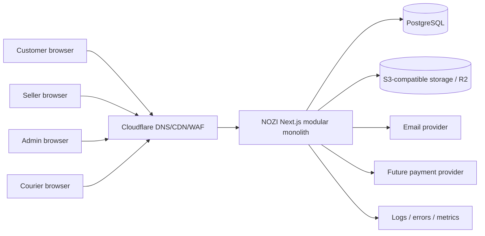
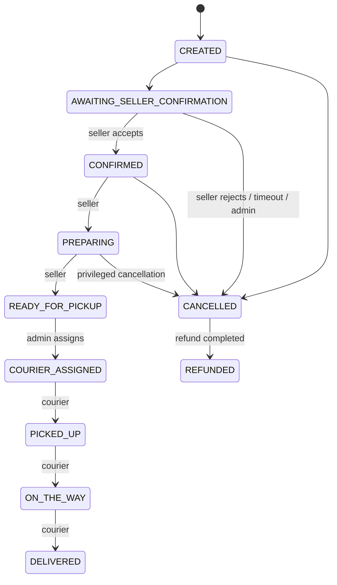
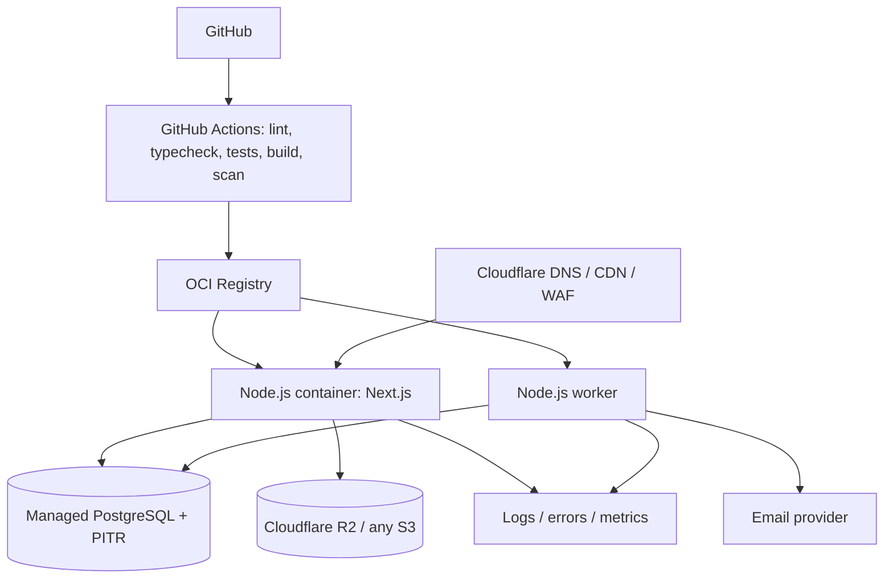

# NOZI — архитектура production-minded MVP

## 1. Назначение документа

NOZI — маркетплейс подарков для запуска в одном городе с реальными покупателями, магазинами, курьерами и сотрудниками платформы. Архитектура должна обеспечить полный путь заказа от корзины до доставки и финансовой проводки, сохраняя возможность дальнейшего выделения приложений и сервисов.

Документ фиксирует архитектурные решения для MVP. Он не является описанием уже реализованной системы.

## 2. Архитектурные принципы

1. **Модульный монолит.** Заказы, каталог, пользователи, доставка и финансы работают в одном deployable backend. Это дает атомарные транзакции и снижает операционную сложность.
2. **Одна web application для MVP.** Customer, seller, courier и admin используют один Next.js runtime с разными route groups, layout и политиками доступа.
3. **API-first.** UI не обращается к базе напрямую. Доменная логика доступна через versioned REST API и application services, пригодные для будущих мобильных клиентов.
4. **PostgreSQL — источник истины.** Статусы, деньги, назначения курьеров и история изменений хранятся в реляционной модели.
5. **Транзакции и идемпотентность.** Критичные команды выполняются атомарно и допускают безопасный повтор.
6. **Vendor-neutral core.** Платежи, object storage, уведомления и наблюдаемость подключаются через адаптеры.
7. **Безопасность на сервере.** UI скрывает недоступные действия для удобства, но каждое право и scope проверяются backend-слоем.
8. **UTC внутри системы.** Пользовательские дата и время интерпретируются в timezone города и сохраняются как UTC instant плюс исходное локальное окно доставки.

## 3. Выбор структуры приложений

### Принятое решение

Для MVP используется один Next.js application и общие пакеты:

```text
apps/
  web/                      # customer + seller + courier + admin + REST API
packages/
  auth/                     # sessions, password hashing, RBAC helpers
  config/                   # typed environment and shared configuration
  database/                 # Prisma schema, migrations, seed, repositories
  notifications/            # notification ports and providers
  observability/            # logger, tracing, error reporting contracts
  order-engine/             # state machine and order application services
  payments/                 # payment ports and cash/test providers
  storage/                  # S3-compatible storage port and adapter
  ui/                       # shared design system and shadcn/ui components
  utils/                    # small side-effect-free utilities
  validation/               # shared Zod schemas and API contracts
```

В `apps/web` интерфейсы разделяются маршрутами:

```text
app/
  (marketplace)/            # публичный каталог и customer account
  seller/                   # seller workspace
  courier/                  # courier workspace
  admin/                    # marketplace operations
  api/v1/                   # REST endpoints
```

### Почему не четыре Next.js приложения сейчас

Отдельные приложения дают независимые релизы и меньшие bundles для каждой роли, но требуют четырех конфигураций auth, observability, deployment и design system. Они также повышают риск расхождения API и UI в ранней фазе. Для команды MVP один runtime проще поддерживать и тестировать end-to-end.

Границы модулей и API должны соблюдаться с первого дня. Если нагрузка, команды или cadence релизов потребуют разделения, seller/admin/courier UI можно вынести в отдельные apps, сохранив `packages/*` и `/api/v1`.

## 4. Технологический стек

| Слой | Выбор | Причина |
| --- | --- | --- |
| Web | Next.js App Router, React, TypeScript strict | SSR/SEO каталога, server rendering и единый runtime |
| UI | Tailwind CSS, shadcn/ui, Radix primitives | Доступные компоненты и контролируемый premium design system |
| API | Route handlers `/api/v1`, Zod, application services | Версионирование и готовность к mobile clients |
| Database | PostgreSQL | Транзакции, constraints, аналитические запросы |
| ORM | Prisma | Типизированная схема, миграции и понятный DX |
| Auth | Better Auth за интерфейсом `packages/auth` | Email/password, database sessions и расширяемость |
| Passwords | Argon2id | Современный memory-hard hashing |
| Tests | Vitest, Playwright, Testcontainers PostgreSQL | Unit, integration, RBAC и critical flow coverage |
| Logging | Pino-compatible structured logger | JSON logs с request correlation |
| Storage | S3-compatible adapter, Cloudflare R2 в production | Portable API и дешёвый object storage |
| Build | pnpm workspaces + Turborepo | Монорепо, кэширование и согласованные команды |
| Runtime | Node.js LTS, standalone Docker image | Переносимость между providers |

Новые major-версии фиксируются lockfile. Runtime версии фиксируются в корне репозитория.

## 5. Контекст и компоненты



### Внутренние модули backend

- **Identity:** users, profiles, sessions, credentials and account state.
- **Catalog:** stores, categories, products, variants, availability and media.
- **Cart:** one active cart per customer/store, price preview and validation.
- **Checkout:** address/recipient validation, pricing snapshot and order creation.
- **Orders:** lifecycle, status history, cancellation rules and order queries.
- **Delivery:** courier pool, assignment and courier workflow.
- **Payments:** payment intents, provider adapters, callbacks and refunds.
- **Finance:** commission snapshot and immutable double-entry ledger.
- **Notifications:** in-app records, provider dispatch and retry.
- **Moderation:** seller/product approval and suspension.
- **Administration:** live board, controlled overrides, notes and audit trail.
- **Reviews/Favorites:** P1 customer engagement modules.

Module code follows `domain -> application -> infrastructure -> transport`. Route handlers validate input and invoke application services; they do not contain business rules or direct multi-table mutations.

## 6. Основные продуктовые ограничения MVP

### Одна корзина — один магазин

В MVP корзина содержит товары одного store. Добавление товара другого магазина предлагает очистить текущую корзину. Один checkout создает один order, одну доставку и один финансовый расчет.

Это убирает необходимость split payment, нескольких окон доставки и частичных возвратов между продавцами. В будущем `order_group` сможет объединить несколько store-specific orders под одним customer checkout.

### Один город, готовность к расширению

Первая публикация включает один активный city, но `Store`, `Address` и `Order` имеют `city_id`. Денежные значения всегда сопровождаются ISO 4217 `currency_code`; locale и timezone задаются у city.

### Inventory

MVP использует числовой stock на variant и optimistic concurrency. При checkout остаток резервируется в транзакции. Отмена освобождает резерв; подтвержденная доставка завершает списание. Товары без учета остатков используют флаг `track_inventory = false`.

## 7. API design

### Конвенции

- Prefix: `/api/v1`.
- JSON request/response; timestamps в ISO 8601 UTC.
- Stable machine-readable error format: `{ code, message, fieldErrors?, requestId }`.
- Cursor pagination для растущих списков; page pagination допустима для небольших admin справочников.
- `Idempotency-Key` обязателен для checkout, payment creation, refund и чувствительных команд.
- Mutations принимают expected version для защиты от lost update.
- OpenAPI генерируется из Zod contracts или проверяется на соответствие им.

### Примеры ресурсов

```text
GET    /api/v1/catalog/products
GET    /api/v1/catalog/products/:slug
GET    /api/v1/cart
POST   /api/v1/cart/items
POST   /api/v1/checkout/orders
GET    /api/v1/me/orders/:orderId
POST   /api/v1/seller/orders/:orderId/transitions
POST   /api/v1/admin/orders/:orderId/courier-assignment
POST   /api/v1/courier/assignments/:assignmentId/transitions
POST   /api/v1/payments/:paymentId/refunds
GET    /api/v1/health/live
GET    /api/v1/health/ready
```

Server Components могут вызывать application/query services напрямую внутри процесса для SSR. Все mutations и внешние клиенты используют тот же application layer, поэтому правила не дублируются.

## 8. Authentication и sessions

- Email/password реализуются в MVP; email хранится в canonical lowercase форме.
- Пароль хэшируется Argon2id с параметрами, вынесенными в server-only config.
- Сессии opaque и хранятся в database; cookie содержит только случайный session token.
- Cookie: `HttpOnly`, `Secure` в production, `SameSite=Lax`, ограниченный path и ротация после login/повышения привилегий.
- Logout отзывает server-side session. Suspension пользователя отзывает все его sessions.
- Login, reset и чувствительные endpoint защищаются rate limiting.
- Архитектура допускает phone identity через отдельную `user_identities`/verification модель без изменения доменных foreign keys.
- Demo credentials создаются только seed-командой вне production и не попадают в production image/config.

## 9. RBAC и object-level authorization

### Роли

`CUSTOMER`, `SELLER`, `COURIER`, `ADMIN`, `SUPER_ADMIN`. Один user может иметь несколько ролей, роли нормализованы через join table.

### Scope rules

| Actor | Разрешенный scope |
| --- | --- |
| Customer | Собственный profile, cart, addresses, orders, favorites и reviews |
| Seller user | Stores, products и orders только seller membership; действия зависят от seller role |
| Courier | Только собственные активные/исторические assignments и связанные delivery data |
| Admin | Marketplace-wide operations согласно admin permissions |

Каждый application service получает `ActorContext` (`userId`, roles, seller memberships, request metadata). Repository queries включают scope predicate, например `seller_id IN actor.sellerIds`; проверка после загрузки не является единственной защитой.

Admin override требует отдельного permission, reason и записи в `audit_logs`. Изменение роли или commission percentage доступно только ограниченному permission set.

## 10. Order lifecycle

### Статусы

```text
CREATED
AWAITING_SELLER_CONFIRMATION
CONFIRMED
PREPARING
READY_FOR_PICKUP
COURIER_ASSIGNED
PICKED_UP
ON_THE_WAY
DELIVERED
CANCELLED
REFUNDED
```

`CREATED` — краткий технический статус внутри транзакции checkout. После успешного создания payment record заказ переходит в `AWAITING_SELLER_CONFIRMATION`. UI обычно впервые видит второй статус.

### Нормальные переходы



Назначение courier до `READY_FOR_PICKUP` можно разрешить позже как configurable dispatch policy. Для первого релиза оно запрещено, чтобы workflow оставался однозначным.

### Central transition service

`OrderTransitionService.transition(command, actor)`:

1. Загружает order с row lock или проверкой version.
2. Проверяет actor role, object scope и allowed transition.
3. Проверяет transition-specific preconditions.
4. Обновляет текущий `orders.status` и `version`.
5. Добавляет immutable `order_status_history` с previous/new status, actor, note и metadata.
6. Добавляет audit entry для admin override.
7. Создает outbox events для notifications/analytics.
8. Коммитит все изменения одной PostgreSQL transaction.

Ни один endpoint не обновляет `orders.status` напрямую. Даже admin override проходит через state machine. Исключительный переход требует explicit override permission, reason и отдельного event type; переход из `DELIVERED` обратно в preparation запрещен.

### Concurrency

`orders.version` увеличивается при каждой mutation. Seller acceptance, courier assignment и cancellation используют optimistic lock/conditional update. Duplicate idempotency key возвращает прежний результат.

## 11. Checkout и ценообразование

Checkout никогда не доверяет price, fee или commission с frontend.

1. Проверить authenticated customer, cart ownership и store availability.
2. Пересчитать цены и доступность variants из database.
3. Заблокировать/условно обновить inventory rows и зарезервировать stock.
4. Рассчитать subtotal, discount, delivery fee, total и commission.
5. Создать immutable order item snapshots: name, SKU, variant, unit price, quantity and tax-ready fields.
6. Скопировать delivery address и recipient data в order snapshot.
7. Создать payment record через выбранный provider adapter.
8. Создать commission snapshot и pending ledger transaction.
9. Перевести order в seller queue и создать outbox notification.

Расчеты выполняются decimal arithmetic; floating point для денег запрещен. Все суммы имеют currency code. Pricing policy — отдельный pure service с тестовыми примерами.

## 12. Payment abstraction

```ts
interface PaymentProvider {
  createPayment(input: CreatePaymentInput): Promise<CreatePaymentResult>;
  getPaymentStatus(providerReference: string): Promise<PaymentStatusResult>;
  refund(input: RefundPaymentInput): Promise<RefundPaymentResult>;
  parseWebhook(request: ProviderWebhookRequest): Promise<VerifiedPaymentEvent>;
}
```

MVP providers:

- `CashPaymentProvider`: создает payment со статусом `PENDING`; после доставки операция может быть отмечена `CAPTURED` по бизнес-правилу.
- `TestPaymentProvider`: детерминированно имитирует success/failure только в non-production.

Provider не меняет order напрямую. `PaymentApplicationService` обрабатывает результат идемпотентно и запускает допустимую доменную команду. Webhooks проходят signature verification, сохраняются с unique provider event ID и безопасно повторяются. Данные карт никогда не проходят через NOZI.

## 13. Finance и ledger

Order хранит immutable финансовый snapshot для быстрого отображения: subtotal, discount, delivery fee, total, commission, seller amount, courier amount и refunded amount.

Источником аудируемой финансовой истории служит double-entry ledger:

- `ledger_accounts` — platform clearing, seller payable, courier payable, cash receivable, refund liability и т.п.
- `ledger_transactions` — бизнес-событие с unique reference.
- `ledger_entries` — debit/credit lines; сумма дебетов равна сумме кредитов в одной currency.

Пример после capture: debit payment clearing / credit seller payable, platform revenue и courier payable. Refund создает компенсирующую transaction; существующие entries не редактируются и не удаляются.

Payout automation не входит в MVP, но balances вычисляются из ledger, а не записываются изменяемым полем.

## 14. Delivery и courier privacy

- Admin создает одну активную assignment на order; reassignment закрывает предыдущую запись с reason.
- Courier подтверждает assignment, отмечает arrival, pickup, start delivery и delivered.
- `courier_latitude`, `courier_longitude`, `location_updated_at` хранят последнее известное положение и nullable в MVP.
- Phone и точный адрес выдаются только назначенному активному courier и только на срок выполнения доставки.
- После завершения assignment courier history возвращает минимизированные данные без лишней PII.
- Непрерывное GPS tracking позже добавляется отдельной append-only location table/stream, не изменяя order schema.

## 15. Notifications и reliable side effects

```ts
interface NotificationChannel {
  send(message: NotificationMessage): Promise<NotificationDeliveryResult>;
}
```

Каналы: in-app (реальный MVP), email (provider или local log adapter), будущие SMS/WhatsApp/Telegram.

В той же transaction, где меняется заказ, создается `outbox_events`. Worker читает события с `FOR UPDATE SKIP LOCKED`, создает notification deliveries и повторяет transient failures с exponential backoff. Это исключает ситуацию, когда заказ обновлен, а событие потеряно между commit и внешним API call.

Процесс worker можно запускать рядом с web container. Это отдельный process type из того же codebase, а не отдельный микросервис.

## 16. Product images и object storage

- Клиент запрашивает signed upload URL у server.
- Server проверяет seller scope, MIME type, размер и лимит количества.
- Upload идет напрямую в S3-compatible storage.
- После подтверждения объект связывается с product image record.
- Public delivery использует CDN domain; database хранит object key, а не vendor URL.
- Allowed types и image processing policy не доверяют расширению файла.
- Orphan objects удаляются background cleanup job.

## 17. Security controls

### Input и transport

- Zod validation на transport boundary; неизвестные поля отклоняются в критичных командах.
- Prisma parameterization защищает от SQL injection; raw SQL допускается только с bound parameters.
- React escaping и запрет unsafe HTML защищают от XSS; rich text в MVP не нужен.
- CSRF tokens/origin checks для state-changing browser requests, SameSite cookies.
- Security headers: CSP, HSTS, `X-Content-Type-Options`, referrer and permissions policy.
- HTTPS в production; trusted proxy configuration фиксируется явно.

### Abuse protection

- Rate limiting для login, signup, password reset, checkout, upload URL, transitions и webhooks.
- Redis-compatible backend может подключаться через adapter; single-node development использует database-backed limiter.
- Request body/upload limits и timeouts.
- Generic auth errors не раскрывают существование account.

### Data access

- Server-only environment validation; секреты никогда не попадают в `NEXT_PUBLIC_*`.
- Seller/customer/courier queries всегда scoped.
- PII маскируется в logs и admin lists.
- Audit logs append-only для admin actions, permission/commission changes и overrides.
- Soft delete применяется к users/stores/products/categories; orders, payments, ledger и audit history не удаляются.
- Database backup, point-in-time recovery и restore drill входят в production operations.

## 18. Observability

- Structured JSON logs с `requestId`, `userId` (когда допустимо), actor role, order ID и duration; секреты, cookies, токены, адреса и телефоны редактируются.
- Global error boundary и server error mapper возвращают request ID.
- Error reporting adapter поддерживает Sentry-compatible provider без зависимости домена.
- OpenTelemetry hooks для HTTP, database и provider calls.
- Metrics: request latency/error rate, orders by status, transition failures, payment failures, outbox lag, notification retries и database pool saturation.
- `/health/live` проверяет process; `/health/ready` проверяет database и обязательные runtime dependencies с коротким timeout.

## 19. UI/UX architecture

- Customer UI mobile-first; catalog SSR/streaming для первого render и SEO.
- Seller/admin используют data tables, filters и live refresh с polling в MVP.
- Courier panel оптимизирован под телефон, крупные действия и слабую сеть.
- Status mutations показывают pending state и защищены от double submit.
- Design tokens в `packages/ui`; customer и operations areas имеют разные layout density, но общий brand language.
- Для каждой async surface обязательны loading/skeleton, empty, error и retry states.
- Toast не является единственным подтверждением критичного действия: новый статус виден в persistent UI.
- Accessibility target: WCAG 2.1 AA для ключевых flows.

Live Orders Board в MVP использует 5–10 second polling или refresh-on-focus. WebSocket/SSE добавляется после подтверждения операционной необходимости.

## 20. Deployment architecture



Cloudflare отвечает за DNS, TLS, CDN статических assets, WAF и rate limits на edge. Next.js запускается как Node standalone container у любого container provider. PostgreSQL — managed service с backups/PITR. R2 используется через S3 API и может быть заменен.

### Deployment flow

1. Pull request: lint, formatting check, typecheck, unit and integration tests, build.
2. Main: reproducible image build, dependency/security scan, migration safety check.
3. Staging: migrate, deploy web/worker, smoke tests.
4. Production: backup verification, backward-compatible migration, rolling deploy, health check.
5. Rollback application image independently; destructive database migrations выполняются expand/migrate/contract в разных releases.

## 21. Environment configuration

Typed server configuration должна включать как минимум:

```text
DATABASE_URL
AUTH_SECRET
APP_URL
NODE_ENV
STORAGE_ENDPOINT
STORAGE_REGION
STORAGE_BUCKET
STORAGE_ACCESS_KEY_ID
STORAGE_SECRET_ACCESS_KEY
STORAGE_PUBLIC_BASE_URL
EMAIL_PROVIDER
EMAIL_FROM
LOG_LEVEL
ERROR_REPORTING_DSN              # optional
```

`.env.example` содержит только имена и безопасные placeholder values. Production secrets задаются secret manager/provider settings. Startup прекращается при отсутствии обязательной или неверно типизированной переменной.

## 22. Масштабирование после MVP

Порядок эволюции без преждевременного выделения сервисов:

1. Read replicas/search index для каталога при подтвержденной нагрузке.
2. Redis-compatible shared cache/rate limiter.
3. SSE/WebSocket service для live orders и courier tracking.
4. Отдельные frontend apps, если команды и release cadence расходятся.
5. Выделение notifications/search/delivery только при измеренной операционной пользе.
6. `order_group` и payment orchestration для multi-store cart.
7. Multi-country tax, currency and localized catalog policies.

Database module ownership и outbox events создают seam для этой эволюции, но PostgreSQL остается источником истины до обоснованной миграции.

## 23. Architecture decision records

| Решение | Статус | Последствие |
| --- | --- | --- |
| Модульный монолит | Accepted | Быстрый MVP и атомарные бизнес-транзакции |
| Один Next.js app | Accepted | Один deploy/runtime; UI можно выделить позже |
| REST `/api/v1` | Accepted | Поддержка mobile и внешних интеграций |
| One-store cart | Accepted | Простая доставка/оплата; multi-store откладывается |
| PostgreSQL + Prisma | Accepted | Строгая relational model и typed access |
| DB sessions + Argon2id | Accepted | Revocation и безопасная email/password auth |
| Double-entry ledger | Accepted | Аудируемые финансы без mutable balance |
| Transactional outbox | Accepted | Надежные notifications/side effects |
| Cloudflare at edge, portable origin | Accepted | CDN/WAF без vendor lock-in backend |

## 24. Definition of architecture readiness

Архитектура считается реализованной для MVP, когда критический сценарий проходит через настоящую PostgreSQL database:

1. Customer создает заказ из store-specific cart.
2. Seller принимает и готовит заказ.
3. Admin видит его и назначает courier.
4. Courier забирает и доставляет заказ.
5. Customer видит неизменяемую status timeline.
6. Admin видит финансовый snapshot и сбалансированные ledger entries.
7. Попытки доступа к чужим данным и нелогичные transitions отклоняются тестами и runtime authorization.

